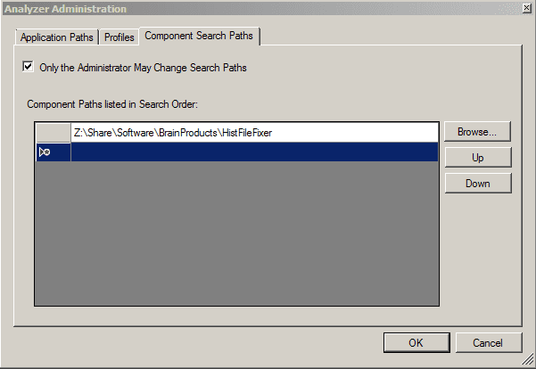

# NEDF reader for Analyzer2

This is a reader component to allow
[Brainvision Analyzer](https://www.brainproducts.com/productdetails.php?id=17)
to read
[NEDF](https://www.neuroelectrics.com/wiki/index.php/Files_%26_Formats#The_.nedf_.28binary.29_data_format)
files (commonly produced by Enobio / StarStim EEG headsets).

## Installation

Simply copy the [`dll` files](https://github.com/tstenner/nedfreader/releases/latest)
to your Analyzer directory or add the downloaded folder to the analyzer config:

